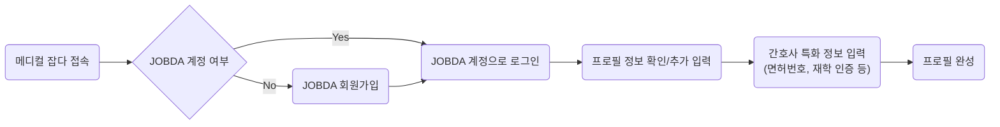
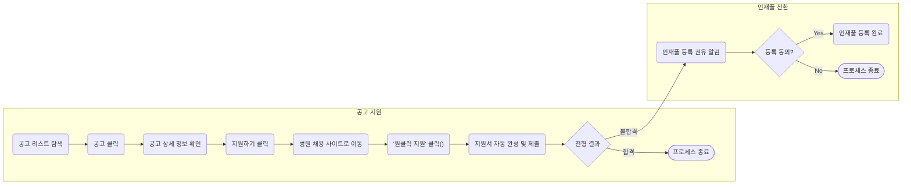

## **0. 문서 정보**

- **프로젝트명**: 메디컬 잡다 - 구직자 플랫폼
- **작성일**: 2025-09-19
- **작성자**: 안가온

## **1. 사용자 페르소나 및 시나리오**

### **1.1 구직자 경험(목표)**

1. **지원 경험 간소화**: 기존 JOBDA 프로필과 연동하여 간호 구직자의 반복적인 지원서 작성을 최소화하고, 원클릭에 가까운 지원 경험을 제공한다.
2. **새로운 기회 연결**
   1. 상급종합병원 지원 후 불합격한 우수 인재를 인재풀에 등록시켜, 검증된 중소/종합병원과의 매칭 기회를 제공함으로써 구직의 공백 기간을 줄인다.
   2. 구직자가 자신의 역량을 바탕으로 자신에게 더 적합한 병원을 추천받고, 입사할 기회를 제공함으로써 구직의 공백 기간을 줄인다.

### **1.2. 핵심 페르소나**

1. **김민지 (23세, 신규 간호사)**
   - **소개**: 지방 간호대학 4학년 졸업예정자. '빅5' 병원 입사가 목표다.
   - **목표**: 상급종합병원 공채에 지원하여 합격하는 것. 채용 준비에 대한 정보가 부족해 불안하다.
   - **불만 (Pain Point)**:
     - "병원마다 다른 지원서 양식에 똑같은 내용을 반복해서 쓰는 게 너무 힘들어요."
     - "상급병원 떨어지면 뭘 해야 할지 막막해요. 다른 병원은 어디가 좋은지 정보가 너무 없어요."
     - "역량검사가 중요하다는데, 어떻게 준비해야 할지 감이 안 와요."
2. **박서연 (29세, 3년차 경력 간호사)**
   - **소개**: 수도권 종합병원 3년차 간호사. 과도한 업무와 낮은 연봉으로 이직을 고민 중이다.
   - **목표**: 워라밸이 좋거나, 전문성을 살릴 수 있는 다른 병원으로 이직하고 싶다.
   - **불만 (Pain Point)**:
     - "일하면서 이직 준비하기가 너무 힘들어요. 공고를 하나하나 찾아볼 시간이 없어요."
     - "이력서를 업데이트하고 제출하는 과정이 번거로워서 지원을 미루게 돼요."
     - "내 경력을 인정해주고, 더 나은 조건을 제시하는 병원에서 연락이 왔으면 좋겠어요."

### **1.3. 사용자 시나리오**

### **Scenario 1: 신규 간호사 '김민지'의 첫 지원과 새로운 기회 발견**

1. **공고 발견**: JOBDA 플랫폼에서 '빅5' 병원 신입 간호사 공채 배너를 보고 '메디컬 잡다'에 접속한다.
2. **지원 준비**: 메디컬 잡다에서 제공하는 '역량검사 연습하기' 기능을 통해 검사를 치르며 실전 감각을 익힌다.
3. **간편 지원**: 가고 싶었던 A 상급종합병원 공고의 '지원하기' 버튼을 클릭한다. 해당 병원 채용 사이트로 이동 후, '메디컬 잡다 프로필 불러오기' 기능으로 기존에 작성해 둔 프로필 정보를 연동하여 지원서를 80% 이상 자동 완성한다.
4. **불합격 및 인재풀 등록**: 안타깝게 A 병원 최종 면접에서 불합격 통보를 받는다. 바로 그때 메디컬 잡다로부터 알림이 온다.

   _"김민지님, 아쉬운 결과를 위로하며 새로운 기회를 제안해 드립니다. 인재풀에 프로필을 등록하고, 검증된 우수 병원으로부터 먼저 면접 제안을 받아보시겠어요?"_

5. **매칭 제안 수락**: '인재풀 등록'에 동의한다. 며칠 후, B 종합병원(준상급)에서 김민지의 역량과 잠재력을 높이 평가하여 면접을 제안했다는 알림을 받는다.
6. **최종 합격**: 제안을 수락하고 면접을 진행한 뒤, B 종합병원에 최종 합격하여 성공적으로 첫 커리어를 시작한다.

### **Scenario 2: 경력 간호사 '박서연'의 스마트한 이직**

1. **프로필 등록**: 이직을 결심한 박서연은 지인 간호사의 추천으로 '메디컬 잡다'에 가입하고, 기존 JOBDA 이력서 정보를 바탕으로 자신의 경력과 희망 근무 조건(연봉, 지역, 진료과목 등)을 상세히 입력하여 프로필을 완성한다.
2. **인재풀 공개**: '매칭 제안받기' 옵션을 활성화하여 자신의 프로필을 인재풀에 등록한다.
3. **매칭 제안**: (C 종합병원 인사팀장이 '메디컬 잡다' 큐레이팅을 요청함) H.X 큐레이터를 통해 매칭을 제안한다.
4. **제안 검토 및 수락**: 박서연은 푸시 알림으로 C 병원의 제안 내용(포지션, 예상 연봉, 근무 조건 등)을 확인한다. 조건이 마음에 들어 '제안 수락' 버튼을 누른다.
5. **간편한 전형 진행**: 해당 인사팀장이 박서연의 프로필을 확인하고 '프로필 합격' 처리한다. C 병원 채용 시스템에 박서연의 프로필이 자동으로 '서류 합격' 상태로 등록된다. 이후 면접 일정을 조율하고 최종 합격하여 성공적으로 이직한다.

## **2. 기능 요구사항**

### **2.1. 핵심 기능**

| **Epic**                     | **User Stories**                                                          | **세부 기능 명세** | **우선순위** |
| ---------------------------- | ------------------------------------------------------------------------- | ------------------ | ------------ |
| **간편 프로필 관리 및 지원** | • (김민지) 기존 JOBDA 계정으로 로그인하여 내 정보를 그대로 가져오고 싶다. |

• (박서연) 경력, 학력, 자격증 등 간호사 직무에 특화된 항목을 포함하여 프로필을 쉽게 작성하고 관리하고 싶다.
• (김민지) 지원서 작성 시, '프로필 불러오기' 버튼으로 90% 이상을 자동 완성하고 싶다. | • JOBDA 계정 SSO(Single Sign-On) 로그인
• 간호사 특화 프로필 템플릿 제공 (경력사항, 학력, 면허/자격증, 희망 근무조건 등)
• 지원하기 클릭 시, 채용 사이트 연동 및 프로필 정보 전달 API 구현 | **High** |
| **인재풀 등록 및 관리** | • (김민지) 상급종합병원 지원 후 불합격 시, 간단한 동의 절차만으로 인재풀에 내 프로필을 등록하고 싶다.
• (박서연) 내가 원할 때 언제든지 인재풀 공개/비공개 상태를 변경하고 싶다.
• (박서연) 어떤 병원이 내 프로필을 열람했는지 알 수 있으면 좋겠다. | • 상급종합병원 지원자 대상 인재풀 등록 동의 플로우 (탈락 시점 알림/팝업)
• 마이페이지 내 인재풀 프로필 공개 여부 설정 (On/Off 토글)
• (향후) 프로필 열람 병원 리스트 제공 기능 | **High** |
| **역량검사 연습** | • (김민지) 실제 역량검사와 유사한 형태의 모의 테스트를 통해 실전 감각을 익히고 싶다.
• (김민지) 검사 결과에 대한 간단한 피드백을 통해 나의 강점과 약점을 파악하고 싶다. | • 검사 완료 후 결과 리포트 페이지 제공 (결과 데이터는 매칭 알고리즘에 활용) | **High** |
| **매칭 제안 및 관리** | • (박서연) 병원으로부터 면접 제안이 오면, 푸시 알림이나 카카오톡 알림으로 즉시 확인하고 싶다.
• (김민지) 제안받은 병원의 상세 정보와 채용 조건을 명확하게 확인하고 싶다.
• (김민지) 받은 제안을 수락하거나 거절하는 의사표현을 앱 내에서 간단히 처리하고 싶다. | • 신규 제안 발생 시 Push/알림톡 발송 시스템
• 제안 상세 페이지 (병원 정보, 포지션, 근무 조건, 연봉 등)
• 제안 수락/거절 버튼 및 상태 관리 (수락 시 H.X로 데이터 전송) | **Medium** |
| **공고 탐색** | • (김민지) 상급종합병원, 종합병원 등 병원 등급별로 공고를 필터링해서 보고 싶다.
• (박서연) 지역, 경력, 근무 형태 등 내가 원하는 조건에 맞는 공고만 모아보고 싶다. | • 채용 공고 리스트 페이지
• 상세 필터 기능 (병원 규모, 지역, 직무, 경력, 근무형태 등)
• 키워드 검색 기능 | **Medium** |
| **광고 구좌 서비스** | | • 상품안(배너, 유료 구좌)를 노출할 수 있음 | **(조율 必)** |

### **2.2. 사용자 플로우**

### **플로우 1: 신규 가입 및 프로필 완성**



**플로우 2: 공고 지원 및 인재풀 등록**



### 2.3. 정보 구조도

https://midastech.atlassian.net/wiki/spaces/JDA/pages/688423021/MJ+I.A.

| **Depth** | **ID**   | **화면명**     | **URL(path)** | **설명**           | **비고** |
| --------- | -------- | -------------- | ------------- | ------------------ | -------- | --- |
| 1         | MAIN-001 |                | /             | 사이트의 첫 화면   |          |
| 2         | MYP-000  | 마이 페이지    | 메디컬 잡다   | /mypage            |          |     |
| 3         | MYP-100  | 프로필 관리    | 메디컬 잡다   | /mypage/profile    |          |     |
| 3         | MYP-200  | 지원 내역      | 메디컬 잡다   | /mypage/apply      |          |     |
| 4         | MYP-210  | 지원 내역 상세 | 메디컬 잡다   | /mypage/apply/{id} |          |     |

| Depth | ID           | 화면명            | URL(path)             | 설명                                                                              | 비고                                                      |
| ----- | ------------ | ----------------- | --------------------- | --------------------------------------------------------------------------------- | --------------------------------------------------------- |
| **1** | **MAIN-001** | **홈**            | `/`                   | 서비스의 첫 화면. 주요 채용 공고, 역량검사 안내 등 핵심 기능으로의 진입점 제공    | 비회원/인증 전 회원에게는 '간호 인증'을 유도하는 CTA 강조 |
| **1** | **JOB-000**  | **채용 공고**     | `/jobs`               | 등록된 모든 채용 공고 리스트를 탐색하고 검색/필터링하는 페이지                    |                                                           |
| **2** | JOB-100      | 채용 공고 상세    | `/jobs/{id}`          | 특정 채용 공고의 상세 요강을 확인하고 지원 절차를 시작하는 페이지                 | '지원하기' 클릭 시 해당 병원 채용 사이트로 이동           |
| **1** | **ASM-000**  | **역량검사**      | `/assessment`         | 역량검사를 소개하고 응시를 시작하는 페이지                                        | 인재풀 등록 필수 조건이므로 미응시자에게 지속적으로 노출  |
| **2** | ASM-100      | 역량검사 결과     | `/assessment/result`  | 역량검사 완료 후 결과 리포트를 확인하는 페이지                                    |                                                           |
| **1** | **AUTH-100** | **로그인**        | `/login`              | 잡다 계정으로 서비스를 시작하는 페이지                                            |                                                           |
| **1** | **AUTH-200** | **회원가입**      | `/signup`             | 잡다 계정이 없는 신규 회원을 위한 가입 페이지. 가입 후 간호 인증으로 연결         | '2.3. 신규 회원' 프로세스에 해당                          |
| **1** | **CERT-000** | **간호 인증**     | `/certify`            | 서비스 이용 자격을 얻기 위해 간호사 또는 간호학생 인증을 진행하는 페이지          | 미인증 회원이 서비스 핵심 기능 접근 시 우선적으로 노출    |
| **2** | CERT-100     | 간호 인증 완료    | `/certify/complete`   | 인증 절차가 성공적으로 완료되었음을 안내하는 페이지                               |                                                           |
| **2** | CERT-200     | 간호 인증 검토 중 | `/certify/pending`    | 재학생/졸업예정자 서류 제출 후, 운영자 승인 대기 중임을 안내하는 페이지           | '수동 승인' 운영 프로세스 필요                            |
| **1** | **MYP-000**  | **마이페이지**    | `/mypage`             | 회원 개인의 활동 현황(지원, 제안 등)을 요약하고 각 관리 메뉴로 진입하는 허브      |                                                           |
| **2** | MYP-100      | **프로필 관리**   | `/mypage/profile`     | 잡다 프로필과 연동된 정보를 확인하고 간호사 특화 정보를 추가/수정하는 페이지      | '매칭 설정(인재풀 공개)' On/Off 기능 포함                 |
| **2** | MYP-200      | **지원 내역**     | `/mypage/apply`       | '메디컬 잡다'를 통해 지원한 공고의 목록과 전형 상태를 확인하는 페이지             |                                                           |
| **3** | MYP-210      | 지원 내역 상세    | `/mypage/apply/{id}`  | 특정 지원 건의 상세 정보 및 전형 단계별 현황을 확인하는 페이지                    |                                                           |
| **2** | MYP-300      | **지원서 관리**   | `/mypage/saved-apply` | JF3, JF4 채용 솔루션으로 제출 후 저장에 동의한 지원서 목록을 관리하는 페이지      | '6. 지원서 관리 정책'에 해당                              |
| **3** | MYP-310      | 지원서 삭제 확인  | -                     | 지원서 관리 목록에서 특정 지원서를 삭제할 때 노출되는 확인 모달(Modal)            | 정보보호팀의 '데이터 소유권' 관련 논의 결과 반영 필요     |
| **2** | MYP-400      | **제안 현황**     | `/mypage/offers`      | 병원(H.X 큐레이터)으로부터 받은 매칭 제안 목록을 확인하는 페이지                  | '7. 매칭 및 제안 정책'에 해당                             |
| **3** | MYP-410      | 제안 상세         | `/mypage/offers/{id}` | 받은 제안의 상세 조건(병원 정보, 포지션, 연봉 등)을 확인하고 수락/거절하는 페이지 |                                                           |
| **2** | MYP-500      | **계정 설정**     | `/mypage/account`     | 알림 설정, 비밀번호 변경, 회원 탈퇴 등 계정 관련 기능을 관리하는 페이지           |                                                           |

### **2.4. 주요 화면 구성 (예시)**

1. **홈/대시보드**
   - 상단: "OOO님, 새로운 커리어를 시작해보세요!" 환영 메시지
   - 중앙:
     - **핵심 CTA 버튼**: [내 프로필 완성하기], [역량검사 연습하기]
     - **매칭 현황**: "현재 2개의 병원에서 OOO님에게 관심을 보이고 있어요." / "받은 제안: 1건"
     - **추천 공고**: "OOO님을 위한 맞춤 공고" (상급종합병원 위주 노출)
   - 하단 GNB: [홈], [채용공고], [받은 제안], [마이페이지]
2. **프로필 페이지**
   - 프로필 완성도 표시 (예: 85%)
   - 인적사항, 학력, 경력, 면허/자격, 어학/수상 등 섹션별 카드 UI
   - 각 섹션별 '수정' 버튼
   - 최상단: **[인재풀에 프로필 공개하기]** On/Off 토글 스위치
3. **받은 제안 페이지**
   - '새로운 제안', '검토 중', '완료' 탭으로 구분
   - 병원명, 포지션, 지역, 제안일이 표시된 카드 리스트 형태
   - 카드 클릭 시 제안 상세 페이지로 이동 (병원 정보, 근무 조건, 연봉 정보 등)
   - 상세 페이지 하단에 [수락하기], [거절하기] 버튼

## **3. 성공 지표 (KPIs)**

- **핵심 성과 지표**
  - 공통
    - **월간 활성 사용자 수 (MAU)**: 플랫폼의 전반적인 활성도 측정
  - **일반 지원 관점**
    - (고민 필요)
  - **매칭 측면 관점**
    - **인재풀 등록 전환율**: 상급종합병원 지원자 중 인재풀 등록 동의 비율 (목표: 30%)
    - **매칭 제안 수락률**: 발송된 제안 대비 구직자가 수락한 비율 (목표: 40%)
- **보조 지표**
  - **프로필 완성률**: 가입자 중 프로필 80% 이상 완성한 사용자 비율
  - **역량검사 응시율**: 가입자 대비 역량검사 연습 완료자 비율
  - **사용자 만족도 (NPS)**: 정기적인 설문을 통한 순추천지수 측정

## **4. 비기능적 요구사항 (예시)**

- **성능**: 페이지 로딩 시간은 3초 이내를 목표로 한다. 프로필 불러오기 기능은 2초 이내에 완료되어야 한다.
- **보안**: 주민등록번호, 면허번호 등 민감한 개인정보는 암호화하여 저장하고, 개인정보보호법을 철저히 준수한다.
- **안정성**: 서비스 가용성은 99.5% 이상을 유지한다.
- **확장성**: 향후 사용자 증가 및 기능 확장에 유연하게 대응할 수 있는 아키텍처로 설계한다.

## **5. 향후 계획**

- **커뮤니티 기능**: 신규/경력 간호사들이 소통하고 정보를 교류할 수 있는 공간 제공
- **병원 리뷰/평점 시스템**: 실제 근무자들이 제공하는 병원 정보를 통해 구직자의 의사결정 지원
- **예상 연봉 조회**: 경력, 직무, 병원 규모에 따른 예상 연봉 정보 제공
- **온보딩 콘텐츠 연계**: 최종 합격자를 대상으로 메디컬 잡다의 온보딩 솔루션(뉴로우) 콘텐츠를 일부 제공하여 입사 전 준비 지원

## 99. 부록

### 99.1. 관련 링크

- [피그마] MJ 디자인 시안 및 사이트맵 ([링크](https://www.figma.com/design/gRqwkHa7LMjLNwuFLe8EZW/-%EB%94%94%EC%9E%90%EC%9D%B8--%EB%A9%94%EB%94%94%EC%BB%AC%EC%9E%A1%EB%8B%A4?node-id=2-15&p=f&t=DN5O5t6dCh40Vafj-0))
- [컨플] MJ 정보 구조도 ([링크](https://midastech.atlassian.net/wiki/spaces/JDA/pages/688423021/MJ+I.A.))
- 구직자 플랫폼 플로우 (Mdermaid)

  - Mermaid Command

    ```mermaid
    graph LR
        A[공고 등록<br/>채용에이전트] --> B[공고 게시<br/>기업 채용사이트 + 메디컬잡다]
        B --> C[공고 탐색<br/>구직자]
        C --> D[지원하기 클릭<br/>채용사이트로 이동]
        D --> E[메디컬잡다<br/>프로필 불러오기]
        E --> F[전형 진행<br/>채용에이전트]

    ```

    ```mermaid

    flowchart LR
        A[공고 등록<br/>채용 에이전트]
        B[인재 큐레이팅 요청<br/>채용 에이전트]
        C[큐레이팅 프로세스<br/>H.X 운영]
        D[제안 수락 인재 프로필 확인<br/>H.X]
        E[프로필 합격 처리<br/>H.X]
        F[서류 합격자 등록<br/>채용 에이전트]
        A-->B-->|데이터 넘김|C-.->|매칭 완료|D-.->E-->F

    ```

    ```mermaid
    graph LR
    	A@{shape: rounded, label: "메디컬 잡다 접속"} --> B@{shape: diamond, label: "JOBDA 계정 여부"}
    	B -- Yes --> C@{shape: rounded, label: "JOBDA 계정으로 로그인"}
    	B -- No --> D@{shape: rounded, label: "JOBDA 회원가입"}
    	D --> C
    	C --> E@{shape: rounded, label: "프로필 정보 확인/추가 입력"}
    	E --> F@{shape: rounded, label: "간호사 특화 정보 입력<br/>(면허번호, 재학 인증 등)"}
    	F --> G@{shape: rounded, label: "프로필 완성"}
    ```

    ```mermaid
    graph LR
    	subgraph "공고 지원"
    		direction LR
    			A@{shape: rounded, label: "공고 리스트 탐색"} --> B@{shape: rounded, label: "공고 클릭"}
    			B --> C@{shape: rounded, label: "공고 상세 정보 확인"}
    			C --> D@{shape: rounded, label: "지원하기 클릭"}
    			D --> E@{shape: rounded, label: "병원 채용 사이트로 이동"}
    			E --> F@{shape: rounded, label: "'원클릭 지원' 클릭()"}
    			F --> G@{shape: rounded, label: "지원서 자동 완성 및 제출"}
    			G --> H@{shape: diamond, label: "전형 결과"}
    			H -- 합격 --> I@{shape: stadium, label: "프로세스 종료"}
    		end
    	subgraph "인재풀 전환"
    		direction LR
    			H -- 불합격 --> J@{shape: rounded, label: "인재풀 등록 권유 알림"}
    			J --> K@{shape: diamond, label: "등록 동의?"}
    			K -- Yes --> L@{shape: rounded, label: "인재풀 등록 완료"}
    			K -- No --> M@{shape: stadium, label: "프로세스 종료"}
    	end
    ```

_E.o.D_

정보 구조도 (Information Architecture)

- - 홈 (Home)
- - 추천 채용 공고
- - 지원 현황 요약
- - 받은 제안 요약
- - 채용 공고 (Job Postings)
- - 공고 검색 (필터: 지역, 경력, 병원 종류 등)
- - 공고 상세 정보
- - 원클릭 지원
- - 내 프로필 (My Profile)
- - 프로필 조회 및 수정 (JOBDA 연동)
- - 경력, 학력, 자격증, 희망 근무 조건
- - 인재풀 등록 및 관리
- - 지원 현황 (Application Status)
- - 지원한 공고 목록
- - 전형 단계별 상태 (서류 > 면접 > 최종)
- - 받은 제안 (Offers Received)
- - 병원으로부터 받은 제안 목록
- - 제안 상세 내용 확인 및 수락/거절
- - 회원 관리 (User Account)
- - 로그인 / 회원가입 (JOBDA 연동)
- - 알림 설정

📋 보강된 정보 구조도 (Enhanced Information Architecture)

아래는 메디컬 잡다 구직자 플랫폼의 상세한 정보 구조도입니다:

📊 상세 정보 구조도 테이블

아래 테이블은 메디컬 잡다 구직자 플랫폼의 전체 정보 구조를 Depth 1부터 Depth 4까지 상세하게 정리한 것입니다:

### 1. 🏠 홈 (Home) 섹션

- 🏠 홈 (Home)
  - 📋 대시보드
    - 📈 지원 현황 요약
    - 📩 받은 제안 요약
    - 🎯 맞춤 추천 공고
    - 📈 프로필 완성도
  - 🔔 알림 센터
    - 📧 지원 결과 알림
    - 💼 새로운 제안 알림
    - 📅 면접 일정 알림
  - 🚀 빠른 액션
    - 🔍 공고 검색 바로가기
    - 📝 프로필 수정 바로가기
    - 💡 역량검사 연습하기

### 2. 💼 채용 공고 (Job Postings) 섹션

- 💼 채용 공고 (Job Postings)
  - 🔍 공고 검색
    - 🏥 병원 종류별 필터
      - 🏛️ 상급종합병원
      - 🏥 종합병원
      - 🏪 병원
      - 🏢 의원
      - 🏠 요양병원
    - 📍 지역별 필터
      - 🌆 서울/경기
      - 🌊 부산/경남
      - 🏔️ 대구/경북
      - 🌾 광주/전남
      - 🏞️ 대전/충청
      - 🌸 강원도
      - 🏝️ 제주도
        - 👩‍⚕️ 경력별 필터
          - 🆕 신입 (0년)
          - 🌱 초급 (1-2년)
          - 💪 중급 (3-5년)
          - 🎯 고급 (6-10년)
          - 👑 전문가 (10년+)
        - 🏥 진료과별 필터
          - 🫀 내과
          - 🦴 외과
          - 👶 소아과
          - 👩‍⚕️ 산부인과
          - 🧠 신경과
          - 🚑 응급실
          - 🏥 중환자실
        - 💰 급여 조건 필터
        - 📅 근무 형태 필터
          - 🌅 주간 근무
          - 🌙 야간 근무
          - 🔄 교대 근무
          - ⏰ 시간제

### 3. 👤 내 프로필 (My Profile) 섹션

- 👤 내 프로필 (My Profile)
  - 📊 프로필 대시보드
    - 📈 프로필 완성도
    - 👀 프로필 조회수
    - 💼 받은 제안 수
  - 📝 기본 정보 관리 (JOBDA 연동)
    - 🎓 학력 정보
    - 📜 자격증 정보
    - 💼 경력 정보 관리
    - 🎯 희망 근무 조건
    - 🎯 인재풀 관리

### 4. 📋 지원 현황 (Application Status) 섹션

- 📋 지원 현황 (Application Status)
  - 📊 지원 현황 대시보드
  - 📄 지원한 공고 목록
  - 📊 전형 단계별 관리
    - 📝 서류 전형
    - 🎤 면접 전형
    - 🏆 최종 전형

### 5. 💌 받은 제안 (Offers Received) 섹션

- 💌 받은 제안 (Offers Received)
  - 📊 제안 현황 대시보드
  - 📋 제안 목록
  - 📝 제안 상세 검토
  - 🤝 제안 응답 (수락/거절/협상)

### 6. 👤 회원 관리 (User Account) 섹션

- 👤 회원 관리 (User Account)
  - 🔐 계정 관리
    - 🚪 로그인/로그아웃
    - 📝 회원가입 (JOBDA 연동)
    - 🔑 비밀번호 관리
  - 🔔 알림 설정
    - 📧 이메일 알림
    - 📱 푸시 알림
    - 💬 SMS 알림
  - 🔒 개인정보 보호
  - 🎛️ 환경 설정

## 📝 정보 구조도 요약

위의 보강된 정보 구조도는 메디컬 잡다 구직자 플랫폼의 전체적인 기능과 사용자 경험을 체계적으로 정리한 것입니다. 주요 특징은 다음과 같습니다:

- **사용자 중심 설계**: 간호사 구직자의 니즈에 맞춰 최적화된 기능 구성
- **JOBDA 연동**: 기존 플랫폼과의 원활한 연동을 통한 사용자 편의성 극대화
- **원클릭 지원**: 반복적인 지원서 작성 과정을 최소화한 효율적인 지원 프로세스
- **인재풀 매칭**: AI 기반 매칭 시스템을 통한 맞춤형 기회 제공
- **데이터 기반 인사이트**: 상세한 대시보드와 통계를 통한 지원 현황 및 성과 분석

이 정보 구조도는 개발팀이 사용자 중심의 직관적이고 효율적인 구직 플랫폼을 구축하는 데 필수적인 가이드라인을 제공합니다.
