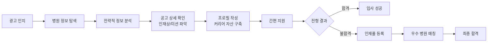
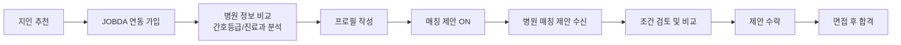

# 메디컬잡다 구직자 플랫폼 리더 보고 자료

> **작성일**: 2025-10-13
>
> **최종 수정일**: 2025-10-14
>
> **버전**: v1.2
>
> **작성자**: 안가온

## 핵심 요약

### 개요

- **메디컬잡다**는 상급종합병원·종합병원 취업을 위한 **필수 관문 플랫폼**
- 단순한 채용 정보 제공을 넘어, 구직자가 **전략적으로 정보를 탐색·분석하여 합격률 높은 지원서를 작성**하고, **한 번의 노력을 영구적인 커리어 자산**으로 만들 수 있도록 지원
- 모든 상급종합·종합병원의 공고와 지원 이력이 메디컬잡다에 집중되어, **취업 활동의 중앙 허브**로 자리매김
- '역량검사'가 상급·종합병원 채용의 표준이 되어 감에 따라, 경쟁사가 모방할 수 없는 **`강력한 네트워크 효과와 해자(Moat)** 구축

### 핵심 가치

- **전략적 정보 제공**: 병원별 인재상, 미션, 상세 현황 등 합격을 위한 핵심 정보를 한곳에 집약
- **커리어 자산화**: 최초 한 번의 프로필 완성이 향후 모든 지원을 10초 만에 끝낼 수 있는 강력한 자산이 됨
- **취업 활동 통합 관리**: 모든 상급·종합병원 지원 이력을 한곳에서 확인하고, 과거 지원서까지 재활용 가능한 **취업 활동의 중앙 허브**
- **신뢰도 높은 비교**: 객관적 데이터로 여러 병원을 능동적으로 비교·분석하여 최적의 선택 지원
- **스마트 매칭**: 역량검사 기반 H.X 큐레이팅을 통한 정밀한 병원 ↔ 인재 매칭

## 타깃 페르소나 (2명)

### 1. 김민지 (23세, 간호학과 졸업예정자)

```
"빅5 병원에 꼭 합격하고 싶은데, 첫 지원이라 뭐부터 어떻게 준비해야 할지 너무 막막해요.
선배들 말만으로는 부족하고, 뭔가 확실한 정보가 필요해요."

```

### **인구통계**

- **나이**: 23세
- **교육**: 비수도권 4년제 간호대학 4학년 2학기 재학 중
- **거주지**: 지방 광역시 (대학 소재지)
- **가족 관계**: 평범한 중산층 가정의 장녀
- **기술 활용도**: 디지털 네이티브. 정보 검색을 위해 네이버 카페, 유튜브, 인스타그램 등 다양한 채널을 적극적으로 활용하며, 온라인 커뮤니티 활동에 익숙함.

### **배경 및 서사**

김민지는 경북 지역의 한 간호대학에서 4년간 성실하게 학업에 임해온 예비 간호사입니다. 고등학교 시절부터 꿈꿔왔던 간호사의 길에 들어섰지만, **졸업과 국가고시를 앞둔 지금은 기대보다 불안감이 더 큽니다.**

그녀의 목표는 명확합니다. 서울의 소위 '빅5'로 불리는 상급종합병원에 신규 간호사로 입사하는 것. 이는 단순히 높은 연봉이나 명예 때문만은 아닙니다. 그녀는 지방 간호대학이 수도권 대형병원의 인력 양성소 역할을 하고 있다는 현실을 잘 알고 있으며, 체계적인 교육 시스템(CLS)과 전문성을 키울 수 있는 환경이 갖춰진 곳에 진입하는 것이 장기적인 커리어와 안정성을 위한 유일한 길이라고 믿고 있습니다.

하지만 그녀가 처한 현실은 녹록지 않습니다. 지방에 거주하는 탓에 서울에서 열리는 채용설명회나 현직자 멘토링 기회에 참여하기 어렵고, 정보의 비대칭을 절감하고 있습니다. 주된 정보원은 네이버 '간준모' 카페의 익명 게시글이나, 먼저 취업한 몇몇 동기 및 선배들의 파편적인 조언뿐입니다. **특히 "신규 간호사 1년 내 이직률이 50%가 넘는다"는 통계와 '태움' 문화에 대한 흉흉한 소문들은 그녀의 불안감을 증폭시킵니다.** 그녀는 단순히 합격하는 것을 넘어, 과도한 업무 부담이나 부적응으로 1년 안에 그만두게 되는 '회전문'의 일부가 되고 싶지 않습니다. **따라서 병원의 규모나 명성뿐만 아니라, 실제적인 간호 등급, 조직 문화, 신규 교육 시스템 등 '진짜 정보'에 대한 갈증이 매우 심합니다.**

### **성향 및 가치관**

- **성실하고 계획적**: 학점 관리를 꾸준히 해왔으며, 취업 준비도 체계적으로 접근하려 노력합니다. 즉흥적인 결정보다는 정보를 충분히 수집하고 분석한 뒤 움직이는 신중한 성격입니다.
- **성취지향적이며 야심 있는**: 지방 출신이라는 핸디캡을 극복하고, 최고의 환경에서 전문가로 성장하고 싶다는 욕구가 강합니다.
- **불확실성에 대한 불안감**: 정보가 부족하거나 통제할 수 없는 상황에 놓이면 스트레스를 많이 받습니다. 실패를 줄이기 위해 최대한 많은 정보를 확보하려는 경향이 있습니다.
- **동료 관계 중시**: 간호 업무의 특성상 팀워크가 중요하다는 것을 인지하고 있으며, 긍정적이고 지지적인 조직 문화가 있는 곳에서 근무하기를 희망합니다.

### **Pain Points & 기대사항**

| Pain Point                                                                                                                                                                                                     | 기대사항                                                                                                                  |
| -------------------------------------------------------------------------------------------------------------------------------------------------------------------------------------------------------------- | ------------------------------------------------------------------------------------------------------------------------- |
| **"정보의 홍수 속 '진짜 정보' 부재"**: 인터넷 카페, 블로그 등 정보는 많지만 신뢰할 수 없고 파편화되어 있습니다. 어떤 병원이 실제로 어떤 인재상을 원하는지, 간호 등급은 어떤지 객관적인 지표를 찾기 어렵습니다. | "신뢰도 높은 병원 정보를 활용해 **남들과는 다른, 합격률 높은 지원서**를 만들고 싶어요. 내 역량을 제대로 증명하고 싶어요." |
| **"반복적이고 비효율적인 지원 과정"**: 가고 싶은 병원은 여러 곳인데, 병원마다 다른 채용 시스템과 자소서 양식에 맞춰 동일한 내용을 반복 입력하는 것은 시간 낭비라고 생각합니다.                                 | "한 번만 제대로 완성해두면, **이 프로필 자체가 내 무기**가 되고, 다음 지원은 훨씬 쉬워졌으면 좋겠어요."                   |
| **"전략 없는 '묻지마 지원'의 한계"**: 단순히 연봉이나 위치만 보고 지원하는 것이 아니라, 나의 가치관과 장기적인 커리어 목표에 맞는 병원인지 판단할 기준이 부족합니다. '조기 이탈'을 피하고 싶습니다.            | "객관적인 데이터로 여러 병원을 **꼼꼼히 비교·분석**해서 후회 없는 최적의 선택을 하고 싶어요."                             |

### **메디컬잡다 솔루션**

1. **합격을 위한 전략적인 병원 정보 제공**
   - 병원별 미션/인재상, 상세 현황(병상 수, 간호 등급) 등 흩어져 있던 핵심 정보를 한곳에 집약합니다.
   - 이를 통해 김민지가 정보 비대칭을 극복하고, 첫 지원서부터 강력한 경쟁력을 갖추도록 지원합니다.
2. **자연스럽게 축적되는 커리어 포트폴리오**
   - 최초 한 번의 프로필 완성을 통해 향후 모든 지원을 10초 만에 완료할 수 있습니다.
   - 김민지의 반복적인 지원서 작성 부담을 줄여, 정보 분석 및 자기소개서 고도화 등 더 중요한 활동에 집중할 수 있도록 돕습니다.
3. **신뢰도 높은 비교 탐색 경험**
   - 객관적 데이터와 상세 정보로 여러 병원을 능동적으로 비교·분석할 수 있습니다.
   - 이를 통해 김민지가 막연한 불안감을 해소하고, 데이터에 기반한 합리적인 의사결정을 내리도록 지원합니다.

### 2. 박서연 (29세, 3년 차 경력 간호사)

```
"3교대 근무에 지쳤어요. 일하면서 이직 준비하는 건 정말 힘드네요.
내 경력을 제대로 인정해주고, 워라밸이 좋거나 더 성장할 수 있는 병원으로 가고 싶은데,
어디가 진짜 좋은 곳인지 비교할 시간도, 정보도 부족해요."

```

### **인구통계**

- **나이**: 29세
- **경력**: 만 3년 차 (5년 미만 경력 이직 그룹에 해당)
- **현직**: 수도권 300병상 이상 종합병원(2차 병원) 내과 병동 간호사
- **거주지**: 경기도 (서울 출퇴근)
- **기술 활용도**: 효율성을 중시. 앱 푸시 알림, 이메일 등 자동화된 정보 수신을 선호하며, 목적 지향적으로 온라인 서비스를 활용함.

### **배경 및 서사**

박서연은 3년간의 임상 경력을 통해 이제는 제법 능숙하게 업무를 처리하는 베테랑의 초입에 선 간호사입니다. **하지만 그녀는 현재 번아웃의 임계점에 서 있습니다. 그녀가 근무하는 수도권 종합병원, 즉 '2차 노동시장'은 만성적인 인력 부족으로 인해 상급종합병원보다 높은 수준의 직무 스트레스와 노동 강도를 감당해야 하는 곳입니다.** 불규칙한 3교대 근무와 과도한 업무량, 낮은 보수 수준은 그녀의 일상을 잠식했고, "이 일을 언제까지 할 수 있을까"라는 회의감을 키웠습니다.

그녀의 이직 동기는 복합적입니다. 단순히 더 높은 연봉을 넘어, '지속 가능한' 간호사로서의 삶을 꿈꿉니다. 일과 삶의 균형을 찾아 결혼이나 육아로 인한 경력 단절을 피하고 싶고, 가능하다면 중환자실이나 응급실 같은 특수 부서 경험을 통해 전문성을 심화시킬 수 있는 상급종합병원으로의 '점프 이직'도 고려하고 있습니다.

하지만 가장 큰 장벽은 '시간과 정보의 부족'입니다. 퇴근 후 지친 몸으로 여러 채용 사이트를 오가며 공고를 비교하고, 이력서를 수정하고, 각 병원의 실제 근무 환경을 파악하는 것은 거의 불가능에 가깝습니다. **그녀는 자신의 3년 경력이 제대로 평가받을 수 있는지, 어떤 병원이 실제로 더 나은 근무 환경과 성장 기회를 제공하는지 객관적인 정보에 기반하여 '후회 없는 선택'을 하고 싶어 합니다.**

### **성향 및 가치관**

- **현실적이고 실용주의적**: 이상적인 꿈보다는 실제적인 근무 조건(연봉, 복지, 근무 강도)과 성장 가능성을 중요하게 생각합니다.
- **소진되었지만 성실한**: 현재 업무에 지쳐있지만, 맡은 바 책임은 다하는 프로 의식을 가지고 있습니다. 이직 준비 과정에서도 비효율적인 것을 싫어하고 핵심적인 정보를 빠르게 얻고자 합니다.
- **신중한 의사결정자**: 첫 이직인 만큼 실패하고 싶지 않은 마음이 큽니다. 감정이나 막연한 평판보다는 객관적인 데이터와 신뢰할 수 있는 정보를 바탕으로 비교하고 결정하려 합니다.
- **안정성 추구**: 장기적으로 근무할 수 있는 안정적인 조직 문화와 예측 가능한 근무 환경을 갈망합니다.

### **Pain Points & 기대사항**

| Pain Point                                                                                                                                                                                              | 기대사항                                                                                                 |
| ------------------------------------------------------------------------------------------------------------------------------------------------------------------------------------------------------- | -------------------------------------------------------------------------------------------------------- |
| **"정보 탐색의 물리적 한계"**: 3교대 근무 후 피곤한 상태에서 여러 채용 사이트를 방문해 공고를 찾고, 각 병원의 실제 근무 환경(간호 등급, 조직 문화)을 비교·분석할 시간과 에너지가 절대적으로 부족합니다. | "객관적인 정보로 여러 병원의 근무 환경과 비전을 **꼼꼼히 비교·분석**해서, 후회 없는 선택을 하고 싶어요." |
| **"번거로운 이직 준비 과정"**: 바쁜 와중에 이력서를 최신으로 업데이트하고, 병원마다 다른 양식에 맞춰 지원서를 다시 작성하는 과정 자체가 큰 부담이며, 이로 인해 지원을 미루게 됩니다.                    | "한 번만 프로필을 완성해두면, **병원에서 먼저 연락**이 오고 간편하게 면접까지 갈 수 있으면 좋겠어요."    |
| **"내 경력 가치의 불확실성"**: 3년 차 경력이 시장에서 어느 정도의 가치를 갖는지, 어떤 병원과 조건이 나에게 최적인지에 대한 객관적인 정보나 가이드가 부족합니다.                                         | "내 경력을 제대로 평가해주고, **나에게 맞는 병원을 추천**받고 싶어요."                                   |

### **메디컬잡다 솔루션**

1. **효율적인 병원 비교 및 분석 도구**
   - 간호 등급, 병상 수, 진료과 등 핵심 정보를 한눈에 비교할 수 있게 제공합니다.
   - 박서연이 바쁜 업무 중에도 자투리 시간을 활용해 여러 병원을 전략적으로 비교하고 필터링하여 의사결정의 질을 높일 수 있도록 지원합니다.
2. **H.X 큐레이팅 기반 매칭 제안**
   - 한 번의 프로필 작성으로 경력과 희망 조건에 맞는 병원의 역제안을 받을 수 있습니다.
   - 박서연이 직접 공고를 탐색하는 수고를 덜어주고, 검증된 병원으로부터 먼저 제안을 받음으로써 효율적이고 성공 확률 높은 이직 과정을 경험하게 합니다.

## 핵심 시나리오 & 사용자 여정

메디컬잡다는 단순한 지원 편의성을 넘어, **전략적 정보 활용과 커리어 자산화**를 통해 구직자의 취업을 도움

### 신규 간호사 김민지의 여정: 게시된 공고를 통한 취업



### 경력 간호사 박서연의 여정: 매칭을 통한 취업



## 주요 화면 & 기능 (피그마 디자인 완료)

### 1. 메인 페이지

**목표**: 첫인상에서 서비스 가치 전달, 참여 병원 신뢰도 제고

**주요 섹션**

- **F-01: (프리미엄) 공고 구좌**: 운영자 선별 상급·종합병원 공고 및 포지션 정보 (공고 이미지, 접수기간, 채용분야별 상세)
- **F-02: 유료 배너**: 수익화를 위한 프로모션 배너 영역
- **F-03: 추천 공고**: 사용자 프로필 기반 맞춤형 공고 추천 (북마크, 병원정보, 공고정보 제공)
- **F-04: 지금 가장 인기있는 채용**: 포지션별 정보 제공 (초기: 추천 채용 → 데이터 축적 후: 인기 채용으로 전환)
- **F-05: 병원 정보**: 상급·종합병원 정보 빠른 확인 (병원 규모, 간호등급, 진료과목)
- **F-06: 네비게이션 메뉴**: 인사담당자 매칭, 병원 매칭, 면접 가이드, 가이드북 바로가기

**사용자 경험**

```
김민지: "삼성서울병원, 서울대병원이 다 있네! 여기서 일할 수 있구나!"
→ 참여 병원 확인 → 추천 공고 클릭 → 상세 확인으로 이동
```

### 2. 공고 상세 페이지

**목표**: 채용 정보를 빠르게 파악하고 간편하게 지원

**주요 기능**

- **앵커 네비게이션**: 원하는 섹션으로 빠른 이동
- **공고 개요**: 병원 로고, 공고명, 핵심 태그 (#상급종합병원, #지역, #신입)
- **채용분야**: 포지션별 상세 정보 (근무지역, 연봉, 직무)
- **상세 모집정보**: 이미지/HTML 지원, 비회원 하루 3회 제한
- **병원 정보**: 의사수, 병상수, 간호등급, 진료과목 (비회원 제한)
- **Sticky CTA 패널**: 스크롤 위치 무관 지원하기 버튼 노출
- **지원 방식 선택 모달**:
  - 이전 지원서 불러오기
  - 현재 프로필로 간편 지원

**사용자 경험**

```
김민지: "3초 만에 내게 맞는 공고인지 확인할 수 있어!"
→ 앵커로 병원정보 이동 → 간호등급 1등급 확인 → 지원하기 클릭
→ "이전 지원서 불러오기" 선택 → 병원 채용사이트 이동 → 80% 자동 완성
```

### 3. 프로필 관리 페이지

**목표**: 간호사 특화 프로필 관리, 매칭 설정 관리

**주요 기능**

- **셀프 브랜딩**: 한 줄 소개 + 사진으로 자기소개
- **기본 정보**: JOBDA 계정 연동, 간호사 면허 정보
- **학력/경력**: 의료기관 특화 정보 (병원등급, 진료과 경험)
- **지식·기술**: 자격증(BLS, ACLS, PALS), 어학, 개발스택
- **경험**: 대내외 활동, 해외 경험, 임상 경험
- **매칭 설정**: 입사제안 받기 ON/OFF, 희망 근무 조건

**간호사 특화 데이터**

- 간호사 면허번호 실시간 검증
- 의료기관 경력 (병원등급, 진료과, 야간/주말 근무 경험)
- 임상 경험 (근무연수, 담당 환자 수, 특수 경험)
- 간호교육 이수 (연수 과정, 이수 시간, 수료증)
- 의료진 자격증 (BLS, ACLS, PALS)

**사용자 경험**

```
박서연: "한 번만 프로필을 작성하면, 여러 병원에서 제안이 와!"
→ 프로필 작성 완료 → 매칭 ON → C 병원 제안 수신
→ 조건 검토 → 수락 → 프로필 합격 → 면접
```

### 4. 지원 방식 선택 모달

**목표**: 두 가지 지원 방식을 명확히 제시하여 혼란 방지

**옵션**

1. **이전 지원서 불러오기**
   - 메디컬잡다에서 작성한 지원서 재사용
   - 빠른 지원 가능
2. **현재 프로필로 간편 지원**
   - 현재 프로필 정보로 즉시 지원
   - 추가 정보 입력 없이 지원

## 사용자 여정 맵 (User Journey Map)

### 김민지 (23세, 신규 간호사) - 전략적 취업 준비와 성공

'김민지' 학생이 메디컬잡다를 **'전략적으로 활용'**하여 첫 취업에 성공하는 여정입니다.

| 단계                          | 사용자 행동                                                                                               | 사용자 생각/감정                                                                                                            | 메디컬잡다의 역할                                                                                                                                                                      |
| ----------------------------- | --------------------------------------------------------------------------------------------------------- | --------------------------------------------------------------------------------------------------------------------------- | -------------------------------------------------------------------------------------------------------------------------------------------------------------------------------------- |
| **1. 인지 및 탐색**           | 간호사 커뮤니티 광고를 통해 메디컬잡다 접속<br>메인 페이지에서 '빅5' 병원 로고와 채용 공고 확인           | "와, 내가 가려던 상급병원 공고는 여기 다 있네. 이 플랫폼만 쓰면 되겠다."<br>🔍 **기대감, 확신**                             | **신뢰 형성 및 독점적 가치 제공**<br>• 최상위권 병원 참여를 노출하여 전문성 강조<br>• 개인화된 추천 공고로 관심 유도                                                                   |
| **2. 정보 분석 및 전략 수립** | 공고 상세 페이지와 '병원 정보' 탭을 오가며 A 병원의 인재상과 진료과 정보 분석<br>자기소개서의 방향을 잡음 | "A 병원은 '소통'을 중시하는구나. 내과 병동 경험을 이 키워드와 연결해서 자소서를 써야겠다."<br>💡 **전략적, 능동적**         | **'첫 지원'의 경쟁력 강화**<br>• 합격 지원서 작성을 위한 **전략적 정보(Asset)** 제공<br>• 병원별 미션, 인재상, 상세 현황 집약<br>• 구직자가 능동적으로 정보를 탐색하고 활용하도록 유도 |
| **3. 프로필 구축 및 지원**    | 분석한 내용을 바탕으로 '프로필 관리' 페이지에서 자기소개 및 경력(실습) 사항 작성<br>'간편 지원' 완료      | "한 번만 제대로 완성해두니, 이 프로필 자체가 내 무기가 된 기분이다. 다음 B 병원 지원은 훨씬 쉽겠지."<br>💪 **투자, 성취감** | **'재사용 가능한 자산' 형성**<br>• 최초 지원의 노력을 **미래를 위한 투자**로 전환<br>• 지원 데이터를 영구적인 커리어 자산으로 구축<br>• 향후 모든 지원을 10초 만에 완료 가능           |
| **4. 기회 확장**              | 지원 완료 후 '인재풀 등록' 동의<br>A 병원 외 다른 병원에서도 면접 제안을 받을 수 있다는 사실에 안도       | "만약 떨어지더라도, 내 프로필을 보고 다른 좋은 병원에서 연락이 올 수도 있겠구나."<br>🛡️ **안정감, 기대감**                  | **새로운 기회 연결**<br>• 한 번의 지원 경험을 더 넓은 기회로 확장<br>• 구직의 공백 기간을 줄여주는 안전망 역할<br>• 검증된 2, 3차 병원과의 매칭 기회 제공                              |
| **5. 매칭 성공**              | B 종합병원 제안 수신 및 수락<br>면접 후 최종 합격                                                         | "메디컬잡다로 전략적으로 준비하니까 정말 합격했다!"<br>🎉 **성취, 만족**                                                    | **취업 성공의 파트너**<br>• H.X 큐레이팅을 통한 정밀 매칭<br>• 성공적인 첫 커리어 시작 지원                                                                                            |

### 박서연 (29세, 경력 간호사) - 전략적 병원 비교와 효율적 이직

'박서연' 간호사가 메디컬잡다를 통해 **병원을 꼼꼼히 비교·분석**하고 효율적으로 이직에 성공하는 여정입니다.

| 단계                            | 사용자 행동                                                                          | 사용자 생각/감정                                                                                                          | 메디컬잡다의 역할                                                                                                                     |
| ------------------------------- | ------------------------------------------------------------------------------------ | ------------------------------------------------------------------------------------------------------------------------- | ------------------------------------------------------------------------------------------------------------------------------------- |
| **1. 인지 및 가입**             | 지인 간호사 추천으로 메디컬잡다 접속<br>JOBDA 계정으로 간편 로그인                   | "기존 정보가 자동으로 연동되니 편하네. 이직 준비가 쉬워질 것 같아."<br>😊 **편리함, 기대감**                              | **진입 장벽 최소화**<br>• JOBDA 계정 연동으로 즉시 시작<br>• 기존 정보 자동 불러오기                                                  |
| **2. 정보 탐색 및 비교**        | 여러 병원의 '병원 정보' 페이지를 방문<br>간호등급, 병상수, 진료과 등을 비교하며 메모 | "A 병원은 간호등급 1등급이고, B 병원은 중환자실이 크네. 데이터로 비교하니 확실히 다르구나."<br>🔍 **분석적, 능동적**      | **전략적 비교 도구 제공**<br>• 객관적인 병원 데이터 집약 제공<br>• 능동적 정보 탐색 지원<br>• 바쁜 업무 중에도 효율적인 의사결정 가능 |
| **3. 프로필 작성 및 매칭 설정** | 간호사 특화 프로필 작성 완료<br>'매칭 제안 받기' ON 설정                             | "한 번만 작성해두면, 병원에서 먼저 연락이 온다니 편하겠다. 조건 맞는 곳만 응답하면 되니까."<br>💼 **효율성, 전략적 사고** | **프로필 기반 역제안 시스템**<br>• 한 번의 프로필 작성으로 지속적 기회 확보<br>• 구직자 주도의 선택권 보장                            |
| **4. 매칭 제안 수신**           | C 병원에서 매칭 제안 알림 수신<br>병원 정보와 제안 조건 검토                         | "C 병원은 내가 비교했던 곳 중 하나인데, 조건도 괜찮네. 진지하게 고민해봐야겠다."<br>🤔 **신중함, 흥미**                   | **정밀한 매칭 제공**<br>• H.X 큐레이터의 전문적 매칭<br>• 경력과 희망 조건에 부합하는 제안                                            |
| **5. 이직 성공**                | 제안 수락 후 프로필 합격 처리<br>면접 진행 후 최종 합격                              | "꼼꼼히 비교하고 선택한 병원이라 후회가 없다. 더 나은 환경에서 새 출발!"<br>🎯 **성취, 확신**                             | **성공적인 이직 파트너**<br>• 전략적 의사결정 지원<br>• 만족도 높은 커리어 전환                                                       |

## 서비스 Identity & Branding

### Brand Essence

**"간호사의 커리어 여정을 연결하는 신뢰의 파트너"**

### Brand Values

1. **간소화 (Simplicity)**: 복잡한 지원 과정을 원클릭으로
2. **연결 (Connection)**: 우수 인재와 검증된 2, 3차 병원의 정밀 매칭
3. **신뢰 (Trust)**: 상급종합병원·종합병원 중심의 공인 파트너, 검증된 병원만 매칭
4. **성장 (Growth)**: 역량검사를 통한 객관적 평가와 성장 기회

### Visual Identity (피그마 기준)

- **Color**: Green 계열 (의료 전문성 + 성장 이미지)
- **Logo**: Medical + JOBDA 조합
- **Typography**: 명확하고 읽기 쉬운 서체
- **UI Pattern**: 카드 기반 레이아웃, 명확한 CTA

## 핵심 차별화 요소

### 1. JOBDA 프로필 연동

- 기존 JOBDA 계정으로 SSO 로그인
- 프로필 정보 자동 연동으로 90% 이상 자동 완성
- 간호사 특화 정보만 추가 입력

### 2. 역량검사 연습 기능

- 실제 검사와 유사한 모의 테스트 제공
- 결과 리포트를 통한 강점/약점 파악
- 매칭 알고리즘에 활용

### 3. 인재풀 매칭 시스템

- 상급종합병원·종합병원 탈락자를 타깃으로 한 인재풀 등록 권유
- H.X 큐레이터를 통한 정밀 매칭
- 검증된 2, 3차 병원과의 연결

### 4. 간호사 특화 정보

- 간호사 면허번호 실시간 검증
- 의료기관 경력, 임상 경험 세부 입력
- BLS, ACLS, PALS 등 의료진 자격증 관리

### 5. 취업 활동 통합 관리 (강력한 경쟁 우위)

**핵심 개념**: 메디컬잡다가 모든 상급종합·종합병원 공고를 독점적으로 보유하게 되면, 구직자의 **모든 지원 이력이 메디컬잡다에 집중**됩니다.

**구직자 가치**

- **통합된 지원 이력 관리**: A 병원, B 병원, C 병원에 지원한 모든 이력을 한곳에서 확인
- **과거 지원서 재활용**: "작년에 삼성서울병원에 썼던 자소서를 불러와서 올해 서울대병원 지원에 활용"
- **지원 전략 수립**: 내가 어떤 병원에, 언제, 어떤 내용으로 지원했는지 한눈에 파악하여 다음 지원 전략 수립
- **취업 활동의 중앙 허브**: 모든 취업 준비 데이터가 한곳에 축적되는 단일 플랫폼

**경쟁 우위 (Network Effect & Moat)**

- 상급종합·종합병원 공고 독점 → 모든 지원 이력 집중 → 재방문 증가
- 구직자가 메디컬잡다를 떠날 이유가 없음 (스위칭 코스트 증가)
- 시간이 지날수록 데이터가 쌓이며 가치 증가 (Data Moat)
- 경쟁사가 모방하기 어려운 **네트워크 효과** 창출

## 성공 지표 (KPIs)

### 핵심 지표

| 지표                 | 목표    | 측정 방법                                                   |
| -------------------- | ------- | ----------------------------------------------------------- |
| **MAU**              | 5,000명 | 월간 활성 사용자 수                                         |
| **인재풀 전환율**    | 30%     | 상급종합병원·종합병원 탈락자(매칭 타깃) 중 인재풀 등록 비율 |
| **매칭 제안 수락률** | 40%     | 발송된 제안 대비 수락 비율                                  |
| **프로필 완성률**    | 80%     | 가입자 중 프로필 80% 이상 완성 비율                         |
| **지원 시작률**      | 30%     | 공고 상세 방문 대비 지원하기 클릭 비율                      |
| **지원 완료율**      | 70%     | 지원하기 클릭 대비 병원 사이트 지원 완료                    |

### 보조 지표

- 역량검사 응시율: 가입자 대비 검사 완료자 비율
- 페이지 체류 시간: 공고 상세 페이지 평균 3분 30초
- 비회원 로그인 전환율: 15% (3회 열람 후 로그인 유도)

## Next Steps

### 단기 (1개월)

1. **프로토타입 완성**: 메인 → 공고 상세 → 프로필 관리 플로우
2. **JOBDA 연동 설계**: SSO, 프로필 API 연동 방안 확정
3. **병원 데이터 수집**: 공공데이터 기반 병원 정보 DB 구축

### 중기 (3개월)

1. **파일럿 테스트**: 3개 상급종합병원·종합병원 대상 테스트
2. **역량검사 시스템**: 검사 문항 개발, 결과 리포트 설계
3. **H.X 큐레이팅**: 매칭 알고리즘 고도화

### 장기 (6개월)

1. **정식 런칭**: 전체 2, 3차 병원 대상 서비스 오픈
2. **인재풀 확대**: 2, 3차 병원 파트너십 확대
3. **취준 콘텐츠 강화**: 취업 설명회 라이브, 합격 후기 등 (커뮤니티는 차후 검토)

## 리스크 & 대응 방안

| 리스크              | 영향도 | 대응 방안                            |
| ------------------- | ------ | ------------------------------------ |
| **병원 참여 저조**  | 높음   | 2, 3차 병원 우선 확보, 인센티브 제공 |
| **개인정보 유출**   | 높음   | 암호화, 접근 제어, 정기 보안 점검    |
| **JOBDA 연동 지연** | 중간   | 자체 프로필 시스템 병행 개발         |
| **역량검사 신뢰도** | 중간   | 전문 기관 협력, 지속적인 문항 검증   |
| **사용자 이탈**     | 중간   | 직관적 UI/UX, 지속적 개선            |

## 관련 자료

### PRD 문서

- [MJ 구직자 플랫폼 전체 PRD](https://www.notion.so/royahn/05_prd/MJ%20%EA%B5%AC%EC%A7%81%EC%9E%90%20%ED%94%8C%EB%9E%AB%ED%8F%BC%20%EC%A0%84%EC%B2%B4%20PRD_250919.md)
- [MJ 메인 페이지 PRD](https://www.notion.so/royahn/05_prd/MJ%20%EB%A9%94%EC%9D%B8%20%ED%8E%98%EC%9D%B4%EC%A7%80%20PRD_251010.md)
- [MJ 공고 상세 페이지 PRD](https://www.notion.so/royahn/05_prd/MJ%20%EA%B3%B5%EA%B3%A0%20%EC%83%81%EC%84%B8%20%ED%8E%98%EC%9D%B4%EC%A7%80%20PRD_250930.md)
- [MJ 프로필 관리 페이지 PRD](https://www.notion.so/royahn/05_prd/MJ%20%ED%94%84%EB%A1%9C%ED%95%84%20%EA%B4%80%EB%A6%AC%20%ED%8E%98%EC%9D%B4%EC%A7%80%20PRD_251009.md)

### 피그마 디자인

- [메인 페이지](https://www.figma.com/design/gRqwkHa7LMjLNwuFLe8EZW/-%EB%94%94%EC%9E%90%EC%9D%B8--%EB%A9%94%EB%94%94%EC%BB%AC%EC%9E%A1%EB%8B%A4?node-id=398-5798)
- [채용정보 페이지](https://www.figma.com/design/gRqwkHa7LMjLNwuFLe8EZW/-%EB%94%94%EC%9E%90%EC%9D%B8--%EB%A9%94%EB%94%94%EC%BB%AC%EC%9E%A1%EB%8B%A4?node-id=411-16292)
- [공고 상세 페이지](https://www.figma.com/design/gRqwkHa7LMjLNwuFLe8EZW/-%EB%94%94%EC%9E%90%EC%9D%B8--%EB%A9%94%EB%94%94%EC%BB%AC%EC%9E%A1%EB%8B%A4?node-id=467-9765)
- [프로필 관리 페이지](https://www.figma.com/design/gRqwkHa7LMjLNwuFLe8EZW/-%EB%94%94%EC%9E%90%EC%9D%B8--%EB%A9%94%EB%94%94%EC%BB%AC%EC%9E%A1%EB%8B%A4?node-id=577-6450)

### 기타

- [정보 구조도 (IA)]([https://midastech.atlassian.net/wiki/spaces/JDA/pages/688423021/MJ+I.A.)](https://midastech.atlassian.net/wiki/spaces/JDA/pages/688423021/MJ+I.A.))

## Q&A 예상 질문

### Q1: 기존 JOBDA와의 차이점은?

**A**: 메디컬잡다는 JOBDA를 베이스로 하는 **스핀오프 서비스**입니다.

**서비스 구조**

- **도메인**: `medical.jobda.im` 서브도메인 사용
- **데이터 공유**: 기존 회원DB, 공고DB를 JOBDA와 공유하되, 간호사 특화 정보(병원등급, 진료과, 임상경험 등)를 추가
- **프로필 연동**: JOBDA의 매칭 프로필 = 메디컬잡다의 프로필로 통합 관리
- **세션 연동**: `jobda.im`과 `medical.jobda.im` 간 세션 공유로 끊김 없는 경험 제공

**핵심 차별점**

- JOBDA는 **전 직군 대상** 채용 플랫폼이지만, 메디컬잡다는 **간호사 특화** 서비스
- 간호사 면허 검증, 임상 경험, 의료기관 경력 등 간호사에게 필요한 정보만 집중 관리
- **2, 3차 병원(상급종합병원·종합병원) 공고를 중점적으로 다룸**
- 역량검사 연습 기능, H.X 큐레이팅 매칭 등 간호사 취업에 특화된 기능 제공

### Q2: 왜 2, 3차 병원에 집중하는가?

**A**: 메디컬잡다의 **핵심 차별점**은 상급종합병원·종합병원(2, 3차 병원) 공고를 중점적으로 다룬다는 것입니다. 이는 신규 간호사의 1순위 목표이자, 경력 간호사들이 선호하는 근무지입니다. 상급종합병원·종합병원 공고를 우선 확보하여 **신뢰도를 구축**하고, 상급종합병원·종합병원 탈락 인재를 타깃으로 한 **스마트 매칭** 전략을 통해 우수 병원과의 연결을 제공합니다.

### Q3: 경쟁사는?

**A**: 간호사 채용 시장에는 이미 여러 서비스가 존재하지만, 메디컬잡다는 차별화된 포지셔닝을 가집니다.

**주요 경쟁사 분석 (2025년 9월 기준)**

| 서비스               | Monthly Visit (PC) | 특징                   | 한계점                          |
| -------------------- | ------------------ | ---------------------- | ------------------------------- |
| **너스케입**         | 23만               | 커뮤니티 + 채용정보    | 단순 정보 나열, 간편 지원 X     |
| **널스잡**           | 60만               | 간호사·간호조무사 대상 | 전 병원 대상, 2·3차 병원 특화 X |
| **널스스토리**       | 3만                | 간호사 채용정보        | 매칭 기능 약함                  |
| **사람인, 잡코리아** | -                  | 전 직군 채용 플랫폼    | 간호사 특화 X                   |

_출처: similarweb / 참고: JOBDA 9월 기준 total visit 553,026_

**메디컬잡다의 차별화 전략**

1. **2, 3차 병원 공고 독점**: 상급종합병원·종합병원 공고를 독점적으로 확보하여 **필수 플랫폼**으로 자리매김
2. **취업 활동 통합 관리 (핵심 해자)**: 모든 지원 이력과 과거 지원서를 한곳에서 관리·재활용 가능 → **네트워크 효과 창출**
3. **전략적 정보 제공**: 병원별 인재상, 미션, 상세 현황 등 합격을 위한 핵심 정보 집약
4. **AI 매칭**: H.X 큐레이팅을 통한 병원 ↔ 인재 정밀 매칭
5. **역량검사 통합**: 채용 플랫폼 내에서 역량검사 연습부터 지원까지 One-Stop
6. **인재풀 전략**: 상급종합병원 탈락자를 타깃으로 한 검증된 병원 매칭

→ 경쟁사는 **정보 제공** 중심이지만, 메디컬잡다는 **지원 간소화 + 스마트 매칭 + 데이터 축적을 통한 네트워크 효과**로 경쟁사가 모방할 수 없는 강력한 해자(Moat) 구축

### Q5: 출시 일정은?

**A**: **2025년 11월 말 출시**를 목표로 합니다.

**출시 전략**

- **11월**: 구직자 플랫폼 정식 오픈
- **12월**: 2025년 간호 졸업 구직자 타깃 집중 마케팅
  - 상급종합병원·종합병원 신입 간호사 채용 시즌이 주로 1~2월에 진행되므로, 12월이 구직자 모집의 골든타임
- **2026년 1~2월**: 상급종합병원 공채 시즌 본격 대응

**초기 예상 트래픽**

- 초기에는 상급종합병원·종합병원 신입 간호사 중심으로 운영 예정
- 점진적으로 경력 간호사 및 타 병원으로 확대

### Q6: 커뮤니티 기능은 제공하나요?

**A**: **초기 버전에서는 커뮤니티 기능을 제공하지 않습니다.**

**제외 이유**

1. **리소스 집중**: 핵심 시나리오(공고 탐색 → 간편 지원 → 매칭) 구현에 집중
2. **운영 부담**: 취업 커뮤니티 생태계 구축에는 상당한 운영 리소스 필요
3. **기존 커뮤니티 존재**: 이미 견고한 취업 커뮤니티 존재
   - [네이버 카페 간준모](https://cafe.naver.com/nursingstudies)
   - [너스케입 커뮤니티](https://m.nurscape.net/)
4. **ROI 불확실**: 운영 리소스를 지속 투입하지 않으면 ROI 기대 어려움

**장기 계획**

- 서비스 안정화 후, 상급종합병원 취준생 콘텐츠(취업 설명회 라이브 등) 분기별 제공 검토
- 리텐션 타깃과 전략이 명확해지면 커뮤니티 재검토 가능

### Q7: 리텐션 전략은?

**A**: 커뮤니티나 채팅이 아닌, **핵심 가치 제공**으로 리텐션을 확보합니다.

**주요 리텐션 요소**

1. **상급·종합병원 정보 업데이트**
   - 반기 1회, 공공 오픈 데이터 활용하여 (반자동) 업데이트
   - 의사수, 간호사수, 간호등급 등 최신 정보 제공
2. **역량검사 연습 기능**
   - 언제든지 돌아와서 연습할 수 있는 도구 제공
   - 결과 리포트로 성장 확인
3. **매칭 제안 알림**
   - 프로필 공개 시 병원의 역제안 수신
   - 푸시 알림으로 재방문 유도
4. **맞춤 공고 추천**
   - 사용자 프로필 기반 추천 공고 지속 노출
   - 새로운 2, 3차 병원 공고 알림
5. **상급·종합병원 취준 콘텐츠 (검토 중)**
   - 분기 1회 취업 설명회 라이브 등
   - 공공팀과 협의 필요

**차별점**

- **채팅 기능 제외**: 앱 서비스와 함께 제공될 때 효과적이므로 초기 제외
- **핵심 시나리오 집중**: 추가 스펙보다 핵심 가치 완성도 우선

_E.o.D_
