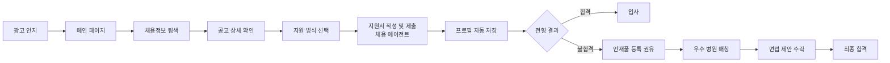
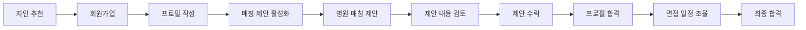

# 메디컬잡다 구직자 플랫폼 리더 보고 자료

> **작성일**: 2025-10-13  
> **버전**: v1.0  
> **작성자**: PM팀

---

## 📌 Executive Summary

**메디컬잡다**는 2, 3차 병원에 지원하려는 모든 간호 구직자를 위한 취업 매칭 플랫폼으로, 반복적인 지원서 작성 부담을 최소화하고 상급종합병원·종합병원 중심의 취업 기회를 연결하는 서비스입니다.

### 핵심 가치
- **지원 간소화**: JOBDA 프로필 연동을 통한 원클릭 지원 경험
- **2, 3차 병원 중점**: 상급종합병원·종합병원 공고를 중점적으로 다루는 차별화된 플랫폼
- **스마트 매칭**: AI 기반 역량검사와 큐레이팅을 통한 정밀한 병원-인재 매칭

---

## 🎯 Target Persona

### 1. 김민지 (23세, 간호학과 졸업예정자)
```
"빅5 병원에 입사하고 싶지만, 
매번 다른 지원서 양식에 같은 내용을 쓰는 게 너무 힘들어요."
```

**특징**
- 지방 간호대학 4학년, 상급종합병원 공채 목표
- 채용 준비 정보 부족으로 불안감 경험

**Pain Points**
- 병원마다 다른 지원서 양식, 반복 입력의 피로감
- 2, 3차 병원 정보 부족 및 접근 어려움
- 역량검사 준비 방법 모르는 막막함

**메디컬잡다 솔루션**
- 프로필 연동으로 80% 이상 자동 완성
- 역량검사 연습 기능 제공
- 2, 3차 병원 공고 중점 제공 및 매칭 기회 연결

---

### 2. 박서연 (29세, 3년차 경력 간호사)
```
"일하면서 이직 준비하기 너무 힘들어요. 
내 경력을 인정해주는 병원에서 먼저 연락 왔으면 좋겠어요."
```

**특징**
- 수도권 종합병원 3년차, 과도한 업무와 낮은 연봉으로 이직 고민
- 워라밸 또는 전문성을 살릴 수 있는 환경 희망

**Pain Points**
- 업무 중 공고 탐색 시간 부족
- 이력서 업데이트 및 제출 과정의 번거로움
- 경력에 맞는 좋은 조건의 병원 정보 부재

**메디컬잡다 솔루션**
- 프로필 공개를 통한 병원의 역제안 수신
- 간편한 프로필 관리 시스템
- H.X 큐레이터를 통한 맞춤형 매칭 제안

---

## 🗺️ 핵심 시나리오 & 사용자 여정

### 신규 간호사 김민지의 여정



### 경력 간호사 박서연의 여정



---

## 🎨 주요 화면 & 기능 (피그마 디자인 완료)

### 1. 메인 페이지
**목표**: 첫인상에서 서비스 가치 전달, 참여 병원 신뢰도 제고

**주요 섹션**
- **매칭 참여 기업 소개**: 상급종합병원·종합병원 공고 및 포지션 정보 (6개 병원 카드)
- **추천 공고**: 사용자 맞춤형 공고 (4x2 그리드, 북마크/뱃지 기능)
- **인기 포지션**: 포지션별 정보 제공 (가로 스크롤 카드)
- **병원 정보**: 빠른 2, 3차 병원 정보 확인 (4x1 그리드)

**사용자 경험**
```
김민지: "삼성서울병원, 서울대병원이 다 있네! 여기서 일할 수 있구나!"
→ 참여 병원 확인 → 추천 공고 클릭 → 상세 확인으로 이동
```

---

### 2. 공고 상세 페이지
**목표**: 채용 정보를 빠르게 파악하고 간편하게 지원

**주요 기능**
- **앵커 네비게이션**: 원하는 섹션으로 빠른 이동
- **공고 개요**: 병원 로고, 공고명, 핵심 태그 (#상급종합병원, #지역, #신입)
- **채용분야**: 포지션별 상세 정보 (근무지역, 연봉, 직무)
- **상세 모집정보**: 이미지/HTML 지원, 비회원 하루 3회 제한
- **병원 정보**: 의사수, 병상수, 간호등급, 진료과목 (비회원 제한)
- **Sticky CTA 패널**: 스크롤 위치 무관 지원하기 버튼 노출
- **지원 방식 선택 모달**: 
  - 이전 지원서 불러오기
  - 현재 프로필로 간편 지원

**사용자 경험**
```
김민지: "3초 만에 내게 맞는 공고인지 확인할 수 있어!"
→ 앵커로 병원정보 이동 → 간호등급 1등급 확인 → 지원하기 클릭
→ "이전 지원서 불러오기" 선택 → 병원 채용사이트 이동 → 80% 자동 완성
```

---

### 3. 프로필 관리 페이지
**목표**: 간호사 특화 프로필 관리, 매칭 설정 관리

**주요 기능**
- **셀프 브랜딩**: 한 줄 소개 + 사진으로 자기소개
- **기본 정보**: JOBDA 계정 연동, 간호사 면허 정보
- **학력/경력**: 의료기관 특화 정보 (병원등급, 진료과 경험)
- **지식·기술**: 자격증(BLS, ACLS, PALS), 어학, 개발스택
- **경험**: 대내외 활동, 해외 경험, 임상 경험
- **매칭 설정**: 입사제안 받기 ON/OFF, 희망 근무 조건

**간호사 특화 데이터**
- 간호사 면허번호 실시간 검증
- 의료기관 경력 (병원등급, 진료과, 야간/주말 근무 경험)
- 임상 경험 (근무연수, 담당 환자 수, 특수 경험)
- 간호교육 이수 (연수 과정, 이수 시간, 수료증)
- 의료진 자격증 (BLS, ACLS, PALS)

**사용자 경험**
```
박서연: "한 번만 프로필을 작성하면, 여러 병원에서 제안이 와!"
→ 프로필 작성 완료 → 매칭 ON → C 병원 제안 수신 
→ 조건 검토 → 수락 → 프로필 합격 → 면접
```

---

### 4. 지원 방식 선택 모달
**목표**: 두 가지 지원 방식을 명확히 제시하여 혼란 방지

**옵션**
1. **이전 지원서 불러오기**
   - 메디컬잡다에서 작성한 지원서 재사용
   - 빠른 지원 가능

2. **현재 프로필로 간편 지원**
   - 현재 프로필 정보로 즉시 지원
   - 추가 정보 입력 없이 지원

---

## 📊 사용자 여정 맵 (User Journey Map)

### 김민지 (23세, 신규 간호사) - 첫 지원 & 새로운 기회

| 단계 | 행동 | 감정 | Pain Point | Gain Point |
|------|------|------|-----------|----------|
| **1. 인지** | 메디컬잡다 광고 접함 | 🤔 호기심 | - | 2, 3차 병원 공고 중점 플랫폼 발견 |
| **2. 탐색** | 메인 페이지 방문 | 😊 기대감 | - | 삼성서울병원, 서울대병원 등 2, 3차 병원 참여 확인 |
| **3. 검색** | 채용정보 필터링 | 🎯 집중 | 원하는 공고 찾기 어려움 | 2, 3차 병원 중심 맞춤 추천 공고 노출 |
| **4. 확인** | 공고 상세 페이지 | 👀 확인 | 정보가 산재되어 있음 | 앵커 네비게이션으로 빠른 확인 |
| **5. 지원** | 지원하기 클릭 | 💪 결심 | 지원서 작성 막막함 | 이전 지원서 불러오기로 80% 자동 완성 |
| **6. 결과** | 불합격 통보 | 😢 실망 | 다음 대안 모름 | 인재풀 등록 권유 알림 수신 (매칭 타깃) |
| **7. 전환** | 인재풀 등록 동의 | 🤞 희망 | - | "검증된 2, 3차 병원에서 제안받을 수 있어요" |
| **8. 매칭** | B 종합병원 제안 수신 | 😲 놀람 | - | "내 역량을 높이 평가해주는구나!" |
| **9. 검토** | 제안 상세 확인 | 🤓 분석 | - | 병원 정보, 포지션, 연봉 명확히 확인 |
| **10. 합격** | 최종 합격 | 😄 기쁨 | - | 성공적인 첫 커리어 시작 |

### 박서연 (29세, 경력 간호사) - 스마트한 이직

| 단계 | 행동 | 감정 | Pain Point | Gain Point |
|------|------|------|-----------|----------|
| **1. 인지** | 지인 간호사 추천 | 🤔 관심 | - | "이직 준비가 쉬워진대" |
| **2. 가입** | JOBDA 계정으로 로그인 | 😊 편함 | - | 기존 정보 그대로 연동 |
| **3. 작성** | 프로필 작성 | ✍️ 집중 | 작성 항목 많음 | 간호사 특화 템플릿으로 쉬운 입력 |
| **4. 설정** | 매칭 제안 ON | 🔔 기대 | - | "병원에서 먼저 연락 올 수 있어!" |
| **5. 대기** | 일상 업무 수행 | 😐 평온 | - | 별도 액션 없이 대기 |
| **6. 수신** | C 병원 매칭 제안 알림 | 😲 놀람 | - | "내 경력에 관심 있는 병원이구나!" |
| **7. 검토** | 제안 상세 확인 | 🤓 분석 | - | 포지션, 예상연봉, 근무조건 명확 |
| **8. 수락** | 제안 수락 버튼 클릭 | 💪 결단 | - | 클릭 한 번으로 의사표시 완료 |
| **9. 전형** | 프로필 합격 처리 | 😊 만족 | - | 서류전형 자동 통과 |
| **10. 합격** | 면접 후 최종 합격 | 😄 성취 | - | 더 나은 조건의 이직 성공 |

---

## 🎨 서비스 Identity & Branding

### Brand Essence
**"간호사의 커리어 여정을 연결하는 신뢰의 파트너"**

### Brand Values
1. **간소화 (Simplicity)**: 복잡한 지원 과정을 원클릭으로
2. **연결 (Connection)**: 우수 인재와 검증된 2, 3차 병원의 정밀 매칭
3. **신뢰 (Trust)**: 상급종합병원·종합병원 중심의 공인 파트너, 검증된 병원만 매칭
4. **성장 (Growth)**: 역량검사를 통한 객관적 평가와 성장 기회

### Visual Identity (피그마 기준)
- **Color**: Green 계열 (의료 전문성 + 성장 이미지)
- **Logo**: Medical + JOBDA 조합
- **Typography**: 명확하고 읽기 쉬운 서체
- **UI Pattern**: 카드 기반 레이아웃, 명확한 CTA

---

## 💡 핵심 차별화 요소

### 1. JOBDA 프로필 연동
- 기존 JOBDA 계정으로 SSO 로그인
- 프로필 정보 자동 연동으로 90% 이상 자동 완성
- 간호사 특화 정보만 추가 입력

### 2. 역량검사 연습 기능
- 실제 검사와 유사한 모의 테스트 제공
- 결과 리포트를 통한 강점/약점 파악
- 매칭 알고리즘에 활용

### 3. 인재풀 매칭 시스템
- 상급종합병원·종합병원 탈락자를 타깃으로 한 인재풀 등록 권유
- H.X 큐레이터를 통한 정밀 매칭
- 검증된 2, 3차 병원과의 연결

### 4. 간호사 특화 정보
- 간호사 면허번호 실시간 검증
- 의료기관 경력, 임상 경험 세부 입력
- BLS, ACLS, PALS 등 의료진 자격증 관리

---

## 📈 성공 지표 (KPIs)

### 핵심 지표
| 지표 | 목표 | 측정 방법 |
|------|------|-----------|
| **MAU** | 5,000명 | 월간 활성 사용자 수 |
| **인재풀 전환율** | 30% | 상급종합병원·종합병원 탈락자(매칭 타깃) 중 인재풀 등록 비율 |
| **매칭 제안 수락률** | 40% | 발송된 제안 대비 수락 비율 |
| **프로필 완성률** | 80% | 가입자 중 프로필 80% 이상 완성 비율 |
| **지원 시작률** | 30% | 공고 상세 방문 대비 지원하기 클릭 비율 |
| **지원 완료율** | 70% | 지원하기 클릭 대비 병원 사이트 지원 완료 |

### 보조 지표
- 역량검사 응시율: 가입자 대비 검사 완료자 비율
- 페이지 체류 시간: 공고 상세 페이지 평균 3분 30초
- 비회원 로그인 전환율: 15% (3회 열람 후 로그인 유도)

---

## 🔄 개발 현황 (2025년 10월 기준)

### ✅ 완료
- [x] PRD 작성 (전체 플랫폼, 메인, 공고 상세, 프로필 관리)
- [x] 피그마 디자인 (메인, 채용정보, 공고 상세, 프로필 관리)
- [x] 사용자 시나리오 및 여정 맵 작성
- [x] 정보 구조도 (IA) 설계

### 🚧 진행 중
- [ ] 프로토타입 개발 (React + TypeScript + Vite)
- [ ] JOBDA API 연동 설계
- [ ] H.X 큐레이팅 시스템 연동 설계
- [ ] 역량검사 시스템 설계

### 📋 예정
- [ ] 백엔드 API 개발
- [ ] 프론트엔드 화면 개발
- [ ] 병원 데이터베이스 구축 (공공데이터 연동)
- [ ] 파일럿 테스트 (선별된 병원 대상)
- [ ] 정식 런칭

---

## 🎯 Next Steps

### 단기 (1개월)
1. **프로토타입 완성**: 메인 → 공고 상세 → 프로필 관리 플로우
2. **JOBDA 연동 설계**: SSO, 프로필 API 연동 방안 확정
3. **병원 데이터 수집**: 공공데이터 기반 병원 정보 DB 구축

### 중기 (3개월)
1. **파일럿 테스트**: 3개 상급종합병원·종합병원 대상 테스트
2. **역량검사 시스템**: 검사 문항 개발, 결과 리포트 설계
3. **H.X 큐레이팅**: 매칭 알고리즘 고도화

### 장기 (6개월)
1. **정식 런칭**: 전체 2, 3차 병원 대상 서비스 오픈
2. **인재풀 확대**: 2, 3차 병원 파트너십 확대
3. **커뮤니티 기능**: 간호사 소통 공간 제공

---

## 🚨 리스크 & 대응 방안

| 리스크 | 영향도 | 대응 방안 |
|--------|--------|-----------|
| **병원 참여 저조** | 높음 | 2, 3차 병원 우선 확보, 인센티브 제공 |
| **개인정보 유출** | 높음 | 암호화, 접근 제어, 정기 보안 점검 |
| **JOBDA 연동 지연** | 중간 | 자체 프로필 시스템 병행 개발 |
| **역량검사 신뢰도** | 중간 | 전문 기관 협력, 지속적인 문항 검증 |
| **사용자 이탈** | 중간 | 직관적 UI/UX, 지속적 개선 |

---

## 📎 관련 자료

### PRD 문서
- [MJ 구직자 플랫폼 전체 PRD](./05_prd/MJ%20구직자%20플랫폼%20전체%20PRD_250919.md)
- [MJ 메인 페이지 PRD](./05_prd/MJ%20메인%20페이지%20PRD_251010.md)
- [MJ 공고 상세 페이지 PRD](./05_prd/MJ%20공고%20상세%20페이지%20PRD_250930.md)
- [MJ 프로필 관리 페이지 PRD](./05_prd/MJ%20프로필%20관리%20페이지%20PRD_251009.md)

### 피그마 디자인
- [메인 페이지](https://www.figma.com/design/gRqwkHa7LMjLNwuFLe8EZW/-%EB%94%94%EC%9E%90%EC%9D%B8--%EB%A9%94%EB%94%94%EC%BB%AC%EC%9E%A1%EB%8B%A4?node-id=398-5798)
- [채용정보 페이지](https://www.figma.com/design/gRqwkHa7LMjLNwuFLe8EZW/-%EB%94%94%EC%9E%90%EC%9D%B8--%EB%A9%94%EB%94%94%EC%BB%AC%EC%9E%A1%EB%8B%A4?node-id=411-16292)
- [공고 상세 페이지](https://www.figma.com/design/gRqwkHa7LMjLNwuFLe8EZW/-%EB%94%94%EC%9E%90%EC%9D%B8--%EB%A9%94%EB%94%94%EC%BB%AC%EC%9E%A1%EB%8B%A4?node-id=467-9765)
- [프로필 관리 페이지](https://www.figma.com/design/gRqwkHa7LMjLNwuFLe8EZW/-%EB%94%94%EC%9E%90%EC%9D%B8--%EB%A9%94%EB%94%94%EC%BB%AC%EC%9E%A1%EB%8B%A4?node-id=577-6450)

### 기타
- [정보 구조도 (IA)](https://midastech.atlassian.net/wiki/spaces/JDA/pages/688423021/MJ+I.A.)

---

## 💬 Q&A 예상 질문

### Q1: 기존 JOBDA와의 차이점은?
**A**: JOBDA는 전 직군 대상 채용 플랫폼이지만, 메디컬잡다는 **간호사 특화** 서비스입니다. 간호사 면허 검증, 임상 경험, 의료기관 경력 등 간호사에게 필요한 정보만 집중 관리하며, **2, 3차 병원(상급종합병원·종합병원) 공고를 중점적으로 다룹니다**.

### Q2: 수익 모델은?
**A**: 
1. **병원 유료 구좌**: 메인 페이지 배너, 프리미엄 공고 위치
2. **H.X 큐레이팅 수수료**: 매칭 성공 시 병원에 수수료 부과
3. **역량검사 유료 모델**: 심화 검사 또는 재응시 시 유료

### Q3: 왜 2, 3차 병원에 집중하는가?
**A**: 메디컬잡다의 **핵심 차별점**은 상급종합병원·종합병원(2, 3차 병원) 공고를 중점적으로 다룬다는 것입니다. 이는 신규 간호사의 1순위 목표이자, 경력 간호사들이 선호하는 근무지입니다. 상급종합병원·종합병원 공고를 우선 확보하여 **신뢰도를 구축**하고, 상급종합병원·종합병원 탈락 인재를 타깃으로 한 **스마트 매칭** 전략을 통해 우수 병원과의 연결을 제공합니다.

### Q4: 개인정보 보호는 어떻게?
**A**: 
- 주민등록번호, 면허번호 등 **민감 정보 암호화** 저장
- JOBDA 계정 SSO 연동으로 **별도 계정 생성 불필요**
- **매칭 설정 ON/OFF**로 사용자가 직접 프로필 공개 여부 제어
- 개인정보보호법 철저 준수, 정기 보안 점검

### Q5: 경쟁사는?
**A**: 
- **사람인, 잡코리아**: 전 직군 대상, 간호사 특화 X
- **병원 자체 채용 사이트**: 개별 지원 필요, 통합 관리 X
- **간호협회 취업 게시판**: 단순 정보 나열, 매칭 기능 X

→ 메디컬잡다는 **간호사 특화 + 2, 3차 병원 중점 + 원클릭 지원 + AI 매칭**으로 차별화

---

**문서 버전**: v1.0  
**최종 수정일**: 2025-10-13  
**승인자**: [PM팀]  
**검토자**: [PM팀]

